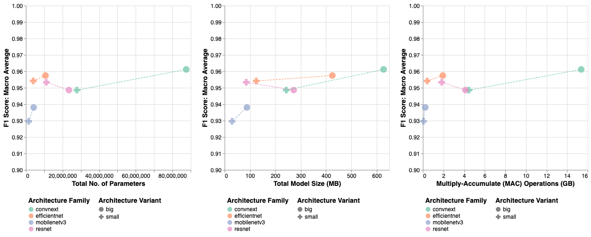

# Vision-based Arrhythmia Classifier

_Exploring computer vision-based approached in prediciting arrhythmias_

## Project Summary
This repo contains the folder template and key materials used to explore computer vision-based approaches to predict arrhythmias using a dataset containing 12-lead ECG recordings. This study opted to focus on pre-trained vision-based CNN models from the torchvision model zoo, using ECG recordings visualised as ECG charts. While the study explored eight different models, the code can easily be extended to included additional models. The study found that fine-tuning pre-trained models can generally lead to high-performing results, although the marginal increase in performance gain is less than proportional to the marginal increase in compute required (see figure below). This has implications for real-life deployments - certain applications may be resource constrained while other may be conscious of expanding carbon footprint via higher power consumption. The study also qualitatively assessed the use of Guided Grad-CAM as an explainability tool, and found it wanting as a diagnostic tool due to limited fidelity.



*Slightly better performance at substantially more resource requirements.*


*Inconsistent activated regions across different layouts. Layout 1 highlights Lead V2 while Layout 2 highlights Lead V1.*

<br><br/>

## Requirements
Packages required for this study is listed in the `environment.yml` file. Note that pytorch and torchvision packages are intentionally excluded - these depend on the specifics of the operating system and GPU used. See the yaml file for further information.

<br>

## Data Source and Pre-processing
The dataset used for this study is the Chapman-Shaoxing database (Zheng, Zhang, et al., 2020), consisting of more than 10,000 12-lead resting ECG recordings, each sampled at 500Hz and with a duration of 10 seconds. It is available to be downloaded here: https://doi.org/10.6084/m9.figshare.c.4560497.
- The raw data should be placed in `data/raw-data` while the accompanying metadata should be placed in `data/metadata`. Further details are provided in the markdown files within each sub-folder.
- The scripts for pre-processing the data are located in the `data/src` folder. Details for each script, including relevant arguments and expected output, are provided within each script and function's docstrings.
- Steps for data pre-processing are briefly explained below.
<br><br/>

To split the data into training and test set, use the `gen_train_test.py`.

To visualise the recordings as ECG charts, run the `gen_image_files.py`. Example of a command and the corresponding output is as follows:
```
python data/src/gen_image_files.py --dataset_type=train --config_name=config1 --short_strip_length=2.5 --num_columns=4 --rhythm_strip_lead=II --image_suffix=_v1_std
```


The generated images should then be packed into an LMDB dataset using the `gen_lmdb_data.py`.
```
python data/src/gen_lmdb_dataset.py --dataset_type=train --config_name=config1
```
<br>

## Model Training and Evaluation
This study optimises six key hyperparameters and retrain using the optimal configuration on the training set, then evaluates on the hold-out test set.
- Hyperparameter optimisation is done in two stages. The first stage only optimises the classification head via a grid search. The second stage fine-tunes all layer, first by doing a Bayes search, followed by a grid search around the optimal configuration identified by the Bayes search.
- All the training-related scripts are available in `analysis/src` - details for each script, including relevant arguments and expected output, are provided within each script and function's docstrings.
- For this study, prototyping was done locally while the main experiments are conducted on the university's HPC. The slurm scripts are available in `analysis/slurm`.
<br><br/>

To generate a grid search configuration, populate the `hyperparameter_grid_template.yaml` file with the relevant information, located in `analysis/config-template`. Then, execute the `gen_grid_configs.py` Python script.

To run grid search locally, execute the `gridsearch_local_run.py` script by providing the folder created when generating a grid search configuration as follows:
```
python analysis/src/gridsearch_local_run.py --experiment_folder=250705_2105_resnet18_head_config1
```
<br>

To consolidate the result of a specific grid search and identify the best hyperparameter combination, execute the `cnn_train_best_model.py` script, parsing the relevant folder.
```
python analysis/src/cnn_train_best_model.py --experiment_folder=250705_2105_resnet18_head_config1
```
<br>

To run the Bayes search locally, execute the `optuna orchestrator.py` script, with a typical command below. Note that the absolute paths were used, and hence would need to be edited.
```
python analysis/src/optuna_orchestrator.py --model_arch=resnet18 --dataset_config=config1 --num_trials=25 --no_freeze_backbone --random_state=42 --num_workers=6 --state_dict_folder=250705_2105_resnet18_head_config1
```
<br>

To consolidate the results of multiple grid searches in the second training stage, and evaluate on the hold-out test set, execute the `consol_results.py` script.
```
python analysis/src/consol_results.py --model_arch=resnet18 --dataset_config=config1 --train_mode=full --runtime_env=local
```
<br>

## Analysis Notebooks
`data/notebook` stores Jupyter notebooks containing simple EDA and pre-processing examples.

`analysis/notebook` stores chart creation and derivation of key figures used within the final report. The discussion notebook also contains examples of saliency map visualisations.
- Note that the implementation of Guided Backpropagation for models using non-ReLU functions takes a simplistic approach by just replacing the activations with a 'Guided ReLU'. This may not be ideal as it decouples the saliency visualisation from the inherent decision-making process.
<br>

## Folder Structure
```
arrhythmia-vision-classifier
 ┣ environment.yml
 ┃
 ┣ data
 ┃  ┣ data-logs
 ┃  ┣ metadata
 ┃  ┣ raw-data
 ┃  ┣ processed-data
 ┃  ┣ notebook
 ┃  ┗ src
 ┃    ┗ ecg_dataset_utils
 ┃
 ┗ analysis
    ┣ config-template
    ┃ ┗ hyperparameter_grid_template.yaml
    ┣ experiments
    ┣ optuna
    ┣ final-results
    ┣ slurm
    ┣ notebook
    ┗ src
      ┗ ecg_utils
```
<br>

## Results Comparison
### Cross-model Comparison
| **Metric**   | **MobileNetV3 Small** | **MobileNetV3 Large** | **ResNet-18** | **ResNet-50** | **EfficientNet-B0** | **EfficientNet-B3** | **ConvNeXt-tiny** | **ConvNeXt-base** |
|-------------|---------------------:|---------------------:|-------------:|-------------:|------------------:|------------------:|----------------:|----------------:|
| Overall F1 | 0.9296 | 0.9380 | 0.9533 | 0.9486 | 0.9541 | 0.9575 | 0.9486 | 0.9612 |
| Precision  | 0.9321 | 0.9397 | 0.9539 | 0.9512 | 0.9550 | 0.9580 | 0.9493 | 0.9621 |
| Recall     | 0.9292 | 0.9366 | 0.9528 | 0.9474 | 0.9534 | 0.9570 | 0.9484 | 0.9603 |
| Accuracy   | 0.9381 | 0.9448 | 0.9580 | 0.9537 | 0.9589 | 0.9618 | 0.9537 | 0.9655 |
| AUROC      | 0.9921 | 0.9905 | 0.9932 | 0.9942 | 0.9925 | 0.9947 | 0.9927 | 0.9950 |

*F1, recall, and precision scores are aggregated using macro-average*

<br>

### Other Methods on Same Dataset
| **Paper / Study**                           | **Macro-F1** | **AFIB** | **GSVT** | **SB** | **SR** |
|---------------------------------------------|-------------:|---------:|---------:|-------:|-------:|
| ConvNeXt-base (Config 1)                    | 0.961        | 0.947    | 0.940    | 0.989 | 0.969 |
| ConvNeXt-base (Config 2)                    | 0.956        | 0.940    | 0.931    | 0.986 | 0.967 |
| Yildirim et al. (2020) (Lead II)<sup>*</sup> | 0.956       | 0.952    | 0.932    | 0.985 | 0.954 |
| Zheng, Chu, et al. (2020) (EGBT)<sup>^</sup> | 0.982       | 0.964.   | 0.979    | 0.996 | 0.989 |
| Zheng, Chu, et al. (2020) (GBT)<sup>^</sup>  | 0.965       | 0.941    | 0.949    | 0.993 | 0.977 |

_*Lead II results were used as the authors noted that it showed the best performance. ^The Extreme Gradient Boosting Tree (EGBT) model was estimated for patients without additional cardiac conditions, while the Gradient Boosting Tree (GBT) model was trained on the full dataset._

<br>

### Vision-based Methods on Different Dataset
| Paper / Study                 | Model                          | No. of Labels | Acc.   | F1     | Rec.   | Prec.  |
|------------------------------|-------------------------------|---------------|--------|-------|-------|-------|
| This study                   | ConvNeXt-base (Config 1)       | 4             | 0.966  | 0.961 | 0.960 | 0.962 |
| This study                   | ConvNeXt-base (Config 2)       | 4             | 0.961  | 0.956 | 0.955 | 0.957 |
| Degirmenci et al. (2022)^    | Custom 2D-CNN                  | 5             | 0.997  | 0.992 | 0.997 | 0.995 |
| Sangha et al. (2022)^,*      | EfficientNet-B3                | 6             | 0.989  | 0.735 | 0.817 | 0.672 |
| Li et al. (2022)             | Ensemble of DSE-ResNet         | 9             | 0.965  | 0.817 | 0.803 | 0.845 |
| Jeong and Lim (2021)         | Custom 2D-CNN                  | 9             | 0.740  | 0.730 | 0.740 | —     |
| Yao et al. (2020)            | 1D-CNN + LSTM + Attention      | 9             | 0.812  | 0.801 | 0.826 | —     |
| Jun et al. (2018)**          | Custom 2D-CNN                  | 8             | 0.991  | 0.979 | 0.986 | —     |

_F1, recall, and precision scores are aggregated using macro-average unless indicated otherwise. Rec. – recall, Prec. – precision. ^Only sample-weighted aggregated scores are available. *Based on results for the hold-out test set. **Based on results with augmented data._

<br><br/>

## References
Ao, R. and He, G. (2023) 'Image based deep learning in 12-lead ECG diagnosis', Frontiers in Artificial Intelligence, 5. Available at: https://doi.org/10.3389/frai.2022.1087370.

Chu, H. (2011) Lightning Memory-Mapped Database (LMDB) (Version 1.6.2). Available at: https://www.symas.com/mdb (Accessed: 24 June 24 2025).

Degirmenci, M., Ozdemir, M.A., Izci, E., and Akan, A. (2022) ‘Arrhythmic Heartbeat Classification Using 2D Convolutional Neural Networks’, IRBM, 43(5), pp. 422–433. Available at: https://doi.org/10.1016/j.irbm.2021.04.002.

dy1901 (2021) ECG Plot: Plot standard ECG chart from data (Version 0.2.8). Available at: https://github.com/dy1901/ecg_plot (Accessed: 13 May 2025).

Jeong, D.U. and Lim, K.M. (2021) ‘Convolutional neural network for classification of eight types of arrhythmia using 2D time–frequency feature map from standard 12-lead electrocardiogram’, Scientific Reports, 11(1), article 20396. Available at: https://doi.org/10.1038/s41598-021-99975-6.

Jun, T.J., Ngyuen, H.M., Kang, D., Kim, D., Kim, D., and Kim, Y. (2018) ‘ECG arrhythmia classification using a 2-D convolutional neural network.’ arXiv. Available at: https://doi.org/10.48550/arXiv.1804.06812.

Li, J., Pang, S., Xu, F., Ji, P., Zhou, S., and Shu, M. (2022) ‘Two-dimensional ECG-based cardiac arrhythmia classification using DSE-ResNet’, Scientific Reports, 12(1), article 14485. Available at: https://doi.org/10.1038/s41598-022-18664-0.

Paszke, A., Gross, S., Massa, F., Lerer, A., Bradbury, J., Chanan, G., Killeen, T., Lin, Z., Gimelshein, N., Antiga, L., Desmaison, A., Köpf, A., Yang, E., DeVito, Z., Raison, M., Tejani, A., Chilamkurthy, S., Steiner, B., Fang, L., Bai, J., and Chintala, S. (2019) ‘PyTorch: An Imperative Style, High- Performance Deep Learning Library.’ arXiv. Available at: https://doi.org/10.48550/arXiv.1912.01703.

Sangha, V., Mortazavi, B.J., Haimovich, A.D., Ribeiro, A.H., Brandt, C.A., Jacoby, D.L., Schulz W.L., Krumholz, H.M., Ribeiro, A.L.P., and Khera, R. (2022) ‘Automated multilabel diagnosis on electrocardiographic images and signals’, Nature Communications, 13(1), article 1583. Available at: https://doi.org/10.1038/s41467-022-29153-3.

TorchVision maintainers and contributors (2016) TorchVision: PyTorch’s Computer Vision library (Version 0.20.1). Available at: https://github.com/pytorch/vision (Accessed: 10 September 2025).

Yao, Q., Wang, R., Fan, X., Liu, J., and Li, Y. (2020) ‘Multi-class Arrhythmia detection from 12-lead varied-length ECG using Attention-based Time-Incremental Convolutional Neural Network’, Information Fusion, 53, pp. 174–182. Available at: https://doi.org/10.1016/j.inKus.2019.06.024.

Yep, T. (2020) torchinfo (Version 1.8.0). Available at: https://github.com/TylerYep/torchinfo (Accessed: September 18, 2025).

Yildirim, O., Talo, M., Ciaccio, E.J., Tan, R.S., and Acharya, U.R. (2020) ‘Accurate deep neural network model to detect cardiac arrhythmia on more than 10,000 individual subject ECG records’, Computer Methods and Programs in Biomedicine, 197, p. 105740. Available at: https://doi.org/10.1016/j.cmpb.2020.105740.

Zheng, J., Zhang, J., Danioko, S., Yao, H., Guo, H., and Rakovski, C. (2020) ‘A 12-lead electrocardiogram database for arrhythmia research covering more than 10,000 patients’, Scientific Data, 7(1), article 48. Available at: https://doi.org/10.1038/s41597-020-0386-x.

Zheng, J., Chu, H., Struppa, D., Zhang, J., Yacoub, S.M., El-Askary, H., Chang, A., Ehwerhemuepha, L., Abudayyeh, I., Barrett, A., Fu, G., Yao, H., Li, D., Guo, H., and Rakovski, C. (2020) ‘Optimal Multi-Stage Arrhythmia Classification Approach’, Scientific Reports, 10(1), article 2898. Available at: https://doi.org/10.1038/s41598-020-59821-7.

Zhu, L. (2025) pytorch-OpCounter (Version 0.1.1-2209072238). Available at: https://github.com/Lyken17/pytorch-OpCounter (Accessed: September 18, 2025).